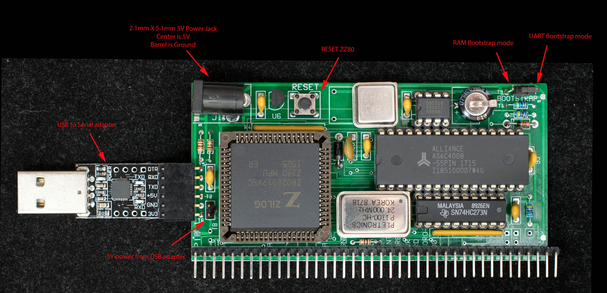

# Getting Started with ZZ80RC

This is a quick start guide to get ZZ80RC power up and running.


## Hardware Setup
Refer to picture above for location of various hardware features.

* ZZ80RC needs a 5V power supply with maximum current of 200mA.
* A TTL-level serial adapter with Transmit and Receive and ground signals. No handshake signals are required. The terminal program parameters are: 115200 baud, Odd parity, 8 data bit, 1 stop and no handshake.
* To boot the first time install a jumper between T10 and T11. This enables UART bootstrap.
* When power is applied, the expected current is 150mA
* The signal assignment of the serial port is designed for the 6-pin CP2102 USB adapter below. Other USB adapter may also be used. Only three signals need to be connected: RxD, TxD and Ground.


## ZZ80Mon

When the board is powered up the first time in UART bootstrap mode (T10 jumpered to T11), set the terminal program (TeraTerm in this example) to baud rate: 115200, data: 8 bit, parity: odd, stop 1, flow control: none, transmission delay 0 msec/char 1 msec/line. In the 'send file' menu, (File →Send file… ) pick 'loadngo.run' and check the 'Binary' box. File transfer will start with a period (.) marks each Intel Hex record correctly received. When file transfer is completed, ZZ80Mon will boot with a '>' prompt displayed.
```
…………………………………………………………………………………………………………………………………………………….X
ZZ80 Monitor v0.23 8/13/18
>
?

>
```
Issue the command 'C0' which will copy the bootstrap monitor to physical page 0. Once the bootstrap is copied to physical page 0, move the jumper to RAM bootstrap mode (T9 to T10); uncheck the 'Binary' box in 'send file' menu; set serial port to baud rate: 115200, data: 8 bit, parity: odd, stop 1, flow control: none, transmission delay 0 msec/char 0 msec/line. Press reset and the ZZ80Mon will display its sign on message:
```
ZZ80 Monitor v0.23 8/13/18
```
ZZ80Mon commands are single letter either upper case or lower case. Depending on the commands, the monitor software will prompt for additional actions.

**H** gives short list of ZZ80Mon commands:
```
>help
G <addr> CR
R <track> <sector>
D <start addr> <end addr>
Z CR
F CR
T CR
E <addr>
X <options> CR
B <options> CR
C <options> CR

>
```
Detailed description of ZZ80Mon commands are in ZZ80Mon manual.
CP/M

To install CP/M 2.2 the first time, pick 'zz80cpm22.hex' in 'send file…' menu and initiate file transfer with 'Binary' box unchecked. After file transfer is completed in a few seconds, type 'C2' to install CP/M2.2 executable into RAM drive. Before CP/M can run, it needs the CP/M files which is contained in the 'cpm22dri.hex' disk image. Install the cpm22dri.hex using the same procedure as zz80cpm22.hex. The file transfer will take about 40 seconds.

After CP/M2.2 and file system are installed, issue **B2** command to boot CP/M.
```
>boot CP/M
2–CP/M2.2,
2 press Return to execute command
Copyright 1979 © by Digital Research
CP/M 2.2 for ZZ80RC
8/12/18 v1.1

a>dir
A: ASM COM : BIOS ASM : CBIOS ASM : DDT COM
A: DEBLOCK ASM : DISKDEF LIB : DUMP COM : DUMP ASM
A: ED COM : LOAD COM : MOVCPM COM : PIP COM
A: STAT COM : SUBMIT COM : SYSGEN COM : XSUB COM
A: XMODEM COM : MBASIC80 COM : STARTREK TXT : ASCIIART TXT
a>
```
## RAM Drive:

Both drive A: & B: are read/write RAM drive. Drive A has very little spare room, but drive B has 254K of space. Drive B's directory needs to be initialized to 0xE5 which can be accomplished with ZZ80Mon command:

**xB** (press enter to execute) ←please note the drive letter B must be in upper case.
