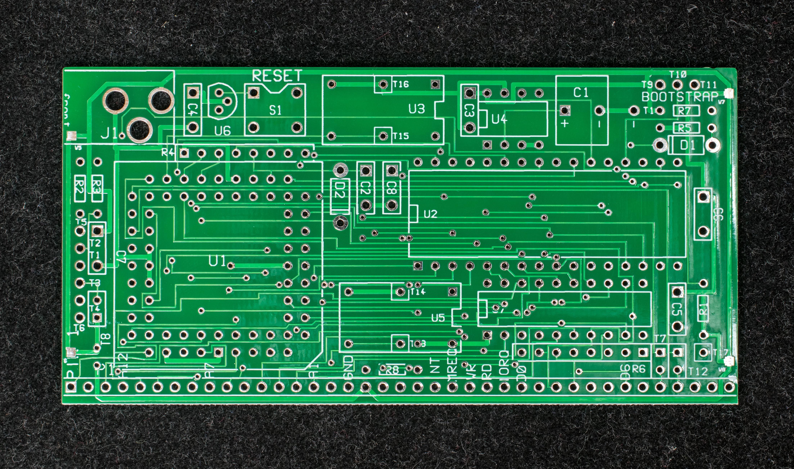
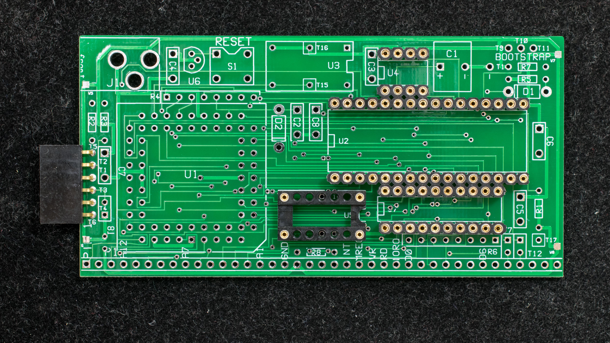
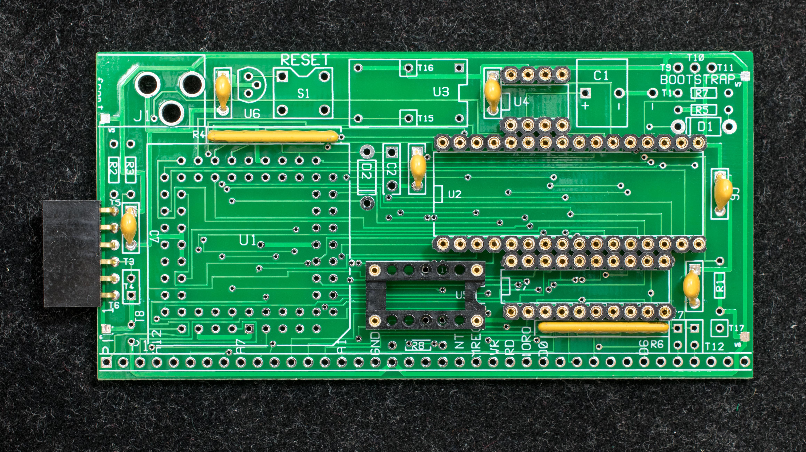
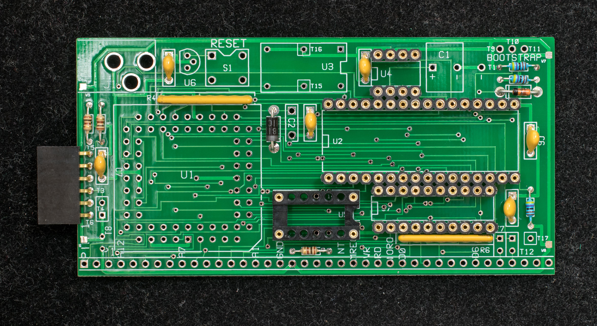
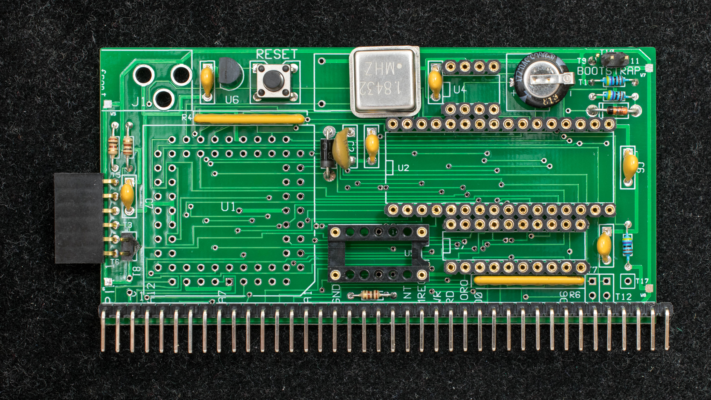
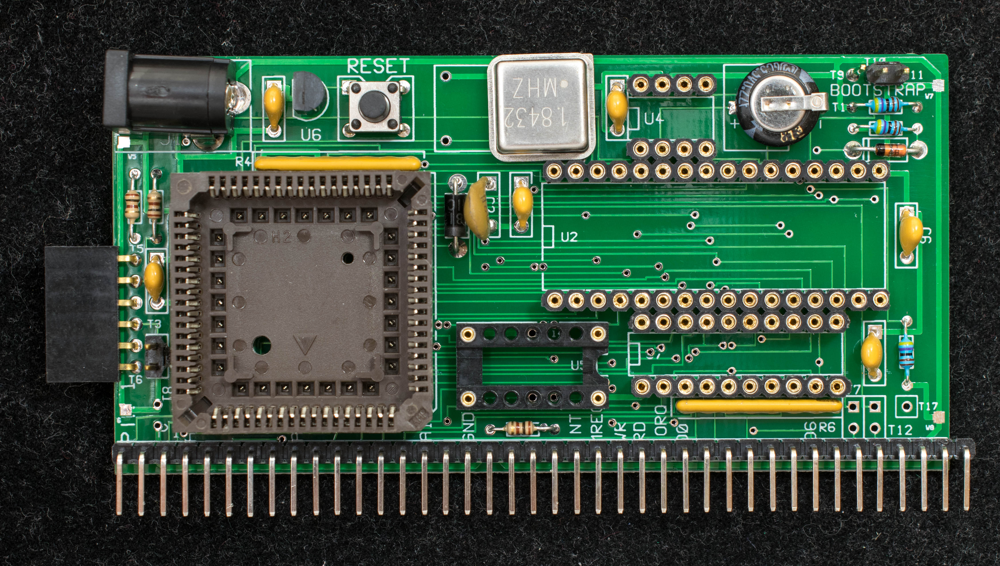
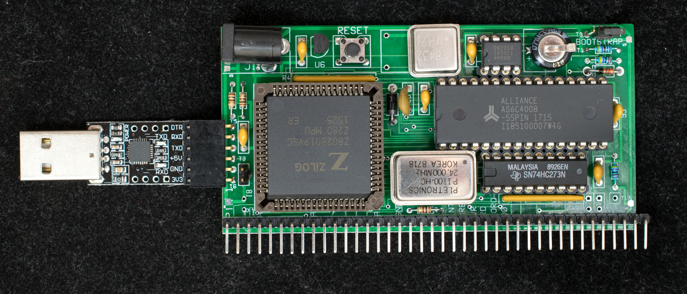

# Construction Log for ZZ80RC

This is a step-by-step construction of ZZ80RC module. Expected construction time is one hour.

1. Start with a bare board

2. Populate serial port connector and IC sockets

3. Add SIP resistors and bypass caps

4. Add resistors and diodes

5. Add RC2014 connector

6. Solder in 1.8432MHz oscillator, voltage supervisor, RESET button, super capacitor and jumper blocks

7. Solder PLCC68 socket and 2.1mmx5.5mm power jack

8. Populate all components and get ready to power up!

