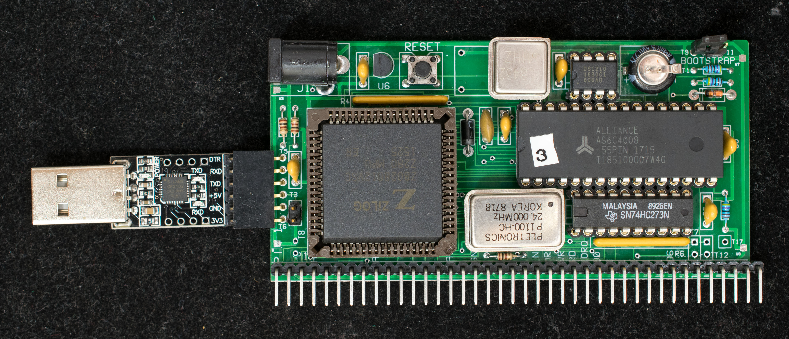
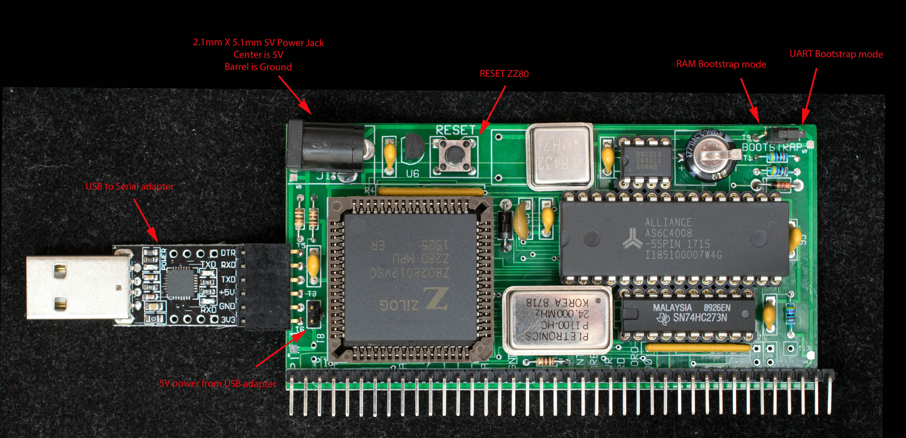

 # ZZ80RC, A Z280 Single-board Computer in Z80-Compatible Mode for RC2014
## Introduction

ZZ80RC (Double-Z80 for RC2014) is a single-board Z280 computer configured to Z80-bus compatible mode. It has a RC2014-compatible connector and is designed to interface with RC2014 I/O modules. ZZ80RC is based on through-hole components and the same form factor as a standard RC2014 board (100mm x 50mm).

## Features

* Z280 CPU configured to Z80-compatible mode running at 24MHz with bus speed of 12 MHz.
* 1/2 megbyte of non-volatile RAM
* RAM-only system, programs are loaded into the non-volatile RAM in UART-bootstrap mode.
* CP/M 2.2 ready.
* Two drives mapped to non-volatile RAM. Drive A: contains CP/M2.2 system files; drive B: is 256Kbyte of RAM drive.
* One internal UART at 115200 baud, odd parity, no handshake
* bootstrap to ZZ80Mon, a simple monitor
* A standalone single-board computer with I/O expansion bus compatible with RC2014 I/O bus

## Modes of Operation

ZZ80RC has two modes of operation as determined by the Bootstrap jumper at power up (see picture below for location of bootstrapjumper). Jumper moved to the corner of the board (T11) set the UART bootstrap mode; jumper moved to (T9) set the RAM bootstrap mode.
### UART Bootstrap

At power up the Z280 CPU is held in idle state until 256 bytes of instruction is uploaded to UART (115200 baud, odd parity, and no handshake) which is then copied to memory starting from location 0x0. Afterward the CPU starts execution from 0x0. In UART bootstrap mode, the program “LoadnGo.run” is send to the UART. LoadnGo contains a 256 bytes binary file that loads the following ZZ80Mon in Intel Hex format and then jump to the starting address of ZZ80Mon. This is the mode to load programs into the non-volatile RAM prior to booting via the RAM bootstrap mode.
### RAM Bootstrap

This is normal mode of operation. At powerup, the MMU is disabled and CPU fetches program from physical location 0 which contains the bootstrap monitor. The bootstrap monitor enables the MMU and write protect physical page 0 where bootstrap monitor resides. It then makes a copy of itself to 0xB000-0xBFFF and jump to it. Lastly the physical page 0 is replaced with logical page 0 which mapped to different physical page. This way the physical page 0 containing the bootstrap monitor is write protected and moved out of way. The application program will have unfettered access to all 64K space of ZZ80.

## Design Files

[Schematic](zz80rc_scm.pdf), the schematic is created using IVEX's WinDraft which is an obsoleted software. Only the PDF file is usable.

Gerber [photoplots](zz80rc_rev0.zip), the pc board was manufactured by Seeed Studio

[Bill of Materials](zz80rc_r0_bom.txt)

Engineering Changes, ← no engineering changes so far.

[Build log](Manuals/ZZ80RC_construction_log.md)
### Software

* UART Bootstrap software, [LoadnGo.run](SysSoftware/loadngo.run), loads the 256-byte bootstrap first which, in turn, loads ZZ80Mon and transfer control to it. If TeraTerm is the terminal software, set the serial port transmission delay to 1 msec/line and check the 'Binary' box in 'Send file…' menu. The transmission delay and checked Binary box are necessary only for loading LoadnGo.run. All subsequent file loads are with zero transmission delay and Binary box unchecked.  Here is the source of [LoadnGo](SysSoftware/LoadnGo.asm), it is assembled with ZDS v3.68 and converted to binary with HEX2BIN and then combined with hex file of ZZ80Mon to create LoadnGo.run

* [SCMonitor](SysSoftware/SCMonitor.hex) is a sophisticated monitor developed by [Steve Cousins](http://scc.me.uk/). It has many features, among them a version of MS BASIC that runs well on ZZ80RC. This version of SCMonitor is beta release for Z280RC but works well in ZZ80RC. 

* [ZZ80Mon](SysSoftware/ZZ80Mon.hex) is the bootstrap monitor for ZZ80RC. It has simple commands to load files, edit/display memory, display RAM disk, zero/fill memory, test memory, copy bootstrap to physical page 0, copy CP/M to RAM disk, and boot CP/M. The software is assembled using Zilog ZDS v3.68.  Here is source of ver 0.28 [ZZ80Mon](SysSoftware/ZZ80mon.asm)

* [ZZ80CPM22](SysSoftware/ZZ80CPM22.hex) is CP/M2.2 executable tailored for ZZ80RC. It is loaded into 0xDC00-0xFFFF with ZZ80Mon. Use 'C2' command to copy it into RAM disk and use 'B2' command to boot into CP/M2.2. The software is assembled using Zilog ZDS v3.68. Here is the source of ver 1.1 of [ZZ80CPM22](SysSoftware/ZZ80CPM22.asm)

* [CPM22DRI](SysSoftware/CPM22DRI.HEX) is system files for CP/M2.2. Use ZZ80Mon to load it into RAM disk A: It includes the XMODEM.COM file transfer program. CPM22DRI image is created using cpmtools.
### Manuals

* [Getting Started](Manuals/GettingStartedGuide.md) guide
* ZZ80Mon [operating manual](Manuals/ZZ80Mon_manual.md)
### References

* Z280 Preliminary Technical Manual. This 'preliminary' manual is in fact the latest manual available.
