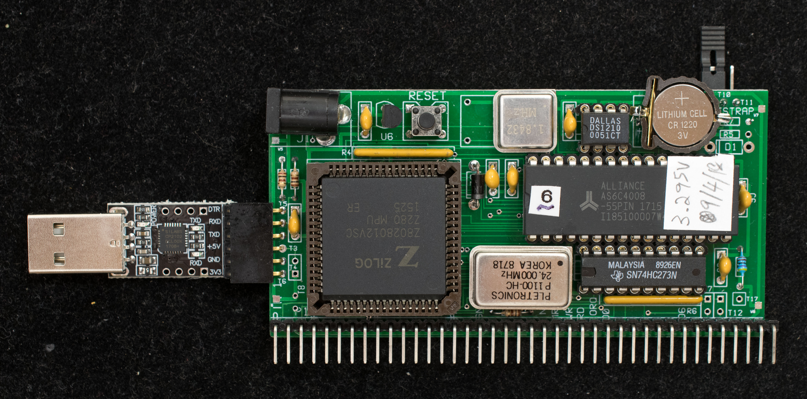
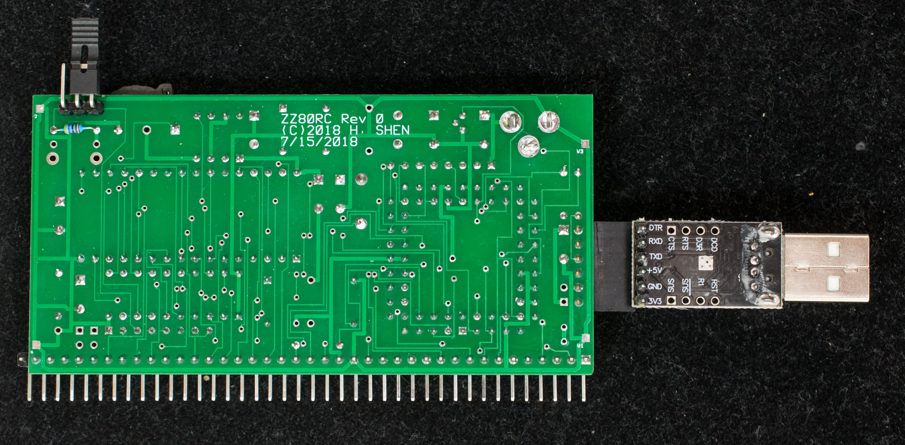

# Replacing super capacitor with CR1220 battery
The super capacitor can only retain memory content for 2-3 days.  A CR1220 battery can retain memory for a year or longer.  This engineering change is a pictorial guide of what's needed to replace the super capacitor with a CR1220 battery.

